# Introduccion

Pequena guia para navegar los recursos de este repositorio.

## Presentacion

Link a la presentacion [Charla los enlaces](./src/main/resources/presentation/)

## 5G

1. Visitar 3GPP especificaciones tecnicas [3GPP](https://portal.3gpp.org/?tbid=All&SubTB=#/55931-tdocs)

2. Descargar swagger para ver las apis [swagger-editor](https://github.com/swagger-api/swagger-editor)

3. Api de muestra [test](./src/main/resources/api/TS32291_Nchf_ConvergedCharging.yaml)

## Concurso

www.hackerrank.com/cpifp-los-enlaces-jornadas-tecnicas-manana

www.hackerrank.com/cpifp-los-enlaces-jornadas-tecnicas-tardes

## Estructuras de datos

- [Arrays](./src/main/java/org/losenlaces/datastructures/ArrayExample.java)
    - Un array es una coleccion de elementos almacendos en posiciones de memoria contiguas. La idea es almacenar juntos diferentes elementos de tipo similar. Esto hace mas facil calcular la posicion the cada elemento simplemente anadiendo un offset a un valor base.

    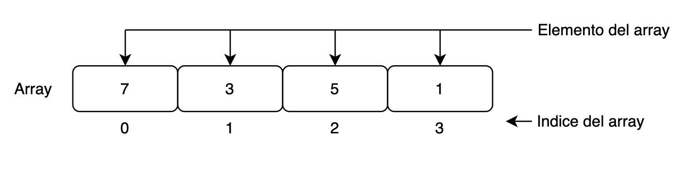

     
- [Linked List](./src/main/java/org/losenlaces/datastructures/LinkedListExample.java)
    - Una linked list es una estructura de datos en la cual, los elementos no estan almacenados de manera contigua. En este caso los elementos estan Unidos por punteros como se muestra en la imagen.

    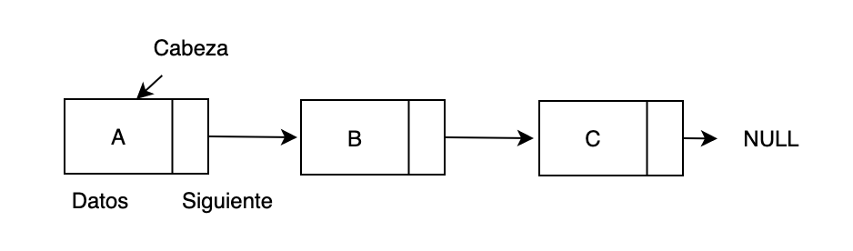

- [Stack & Queue](./src/main/java/org/losenlaces/datastructures/StackAndQueuesExample.java)
    - Un Stack es una estructura linear en la cual los elementos se insertan y se eliminan por un solo lado de la lista, el principio. La Stack sigue el principio LIFO (las in first first out) el ultimo que entra es el primero que sale. La operacion de insertat un element en la stack se llama push y la accion de borrar se llama pop. En la stack siempre temenos una referncia al ultimo element insertado llamado top.

    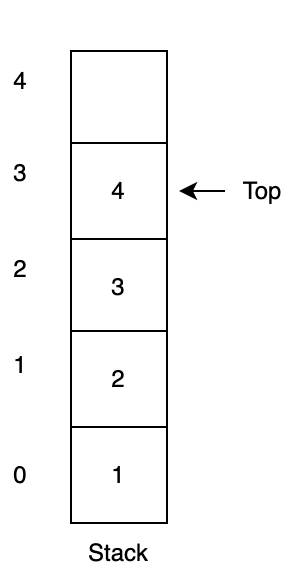

    - Las Queue es una estructura linear cuyos elementos son intertados al final y solo se pueden eliminar por el principio. Las colas siguen el principio FIFO (First in first out) el primer element insertado ser el primero en salir. La accion de inserter un element en la queue se llama enqueue y la accion de eliminar un element se llama dequeue. En una queue siempre mantenemos dos referencias una al element que esta al principio de la lista y otra al element que esta al final.
    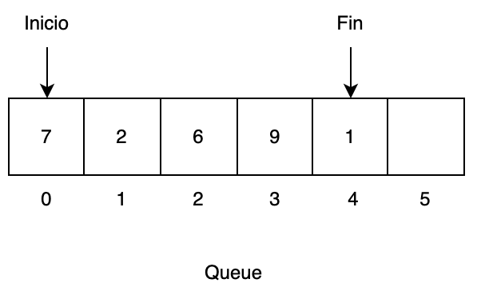

- [Binary Search Tree](./src/main/java/org/losenlaces/datastructures/BinaryTreeExample.java)
    - El Tree es una estructura de datos jerarquizada que se usa para representar y organizar datos de manera que es facil de navegar y buscar. Es una colecion de nodos que estan conectdos con una relacion jerarquica. El nodo principal se llama raiz y los nodos que parten de ahi se llaman nodos hijos. Cada node puede tener multiples hijos y estos a su vez pueden tener otros nodos hijos formando una estructura recursive como se ve en la imagen.

   - Los Binary tree que en vez de tener un numero indefinido de nodos hijos solo puede tener dos, lo cual hace que cada nuevo element insertado en la lista solo pueda tener una posicion en el arbol. Esto permite realizar operaciones de busqueda de una manera mucho mas eficiente. Aunque esto puede llevar a arboles que no esten correctamente balanceados y tenga un nodo con muchos mas hijos que los demas.

    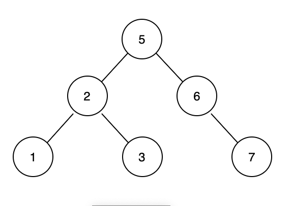

- [TRIE](./src/main/java/org/losenlaces/datastructures/BinaryTreeExample.java)
    - Otra especializacion muy interesante es el trie. Este es un tipo de estructura especializado para trabajar con cadenas de texto, de manera que cada nodo puede tener tantos hijos como letras en el alfabeto, creando una estructura como la que se muestra en la imagen.
    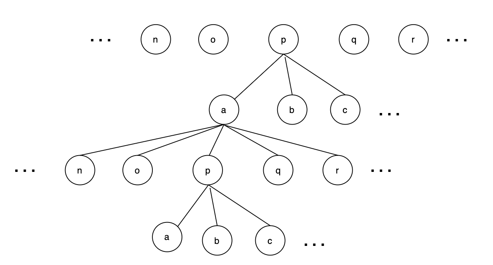

- [Hash Map](./src/main/java/org/losenlaces/datastructures/HashMapExample.java)
    - Un HashMap es una estructura de datos que se usa para almacenar y recuperar valores pos sus claves.

    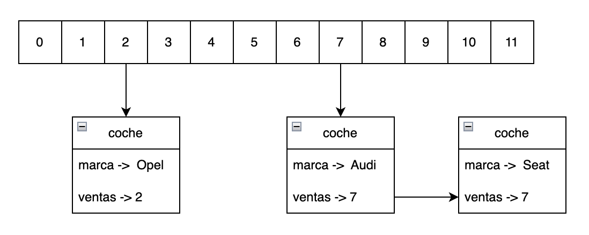

- [Graph](./src/main/java/org/losenlaces/datastructures/GraphExample.java)
    - Un Graph es una estructura no linear compuesta por vertices y lados. Los vertices se pueden considerer nodos y los lados son las conexiones entre dos nodos de un Graph.
    Mas fomalmente un grafico esta compuresto por un set de vertices(V) y un set de lados(E). El grafico se pude representar como G(E, V).

    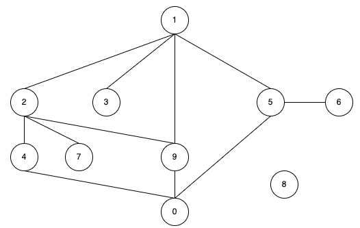

## Algoritmos

- Ordenacion
    - Un algoritmo de busqueda se usa para reorganizar un array o lista de elementos de acuerdo a la comparacion the un operador de los elementos. La comparacion se usa para decider el nuevo orden de los elemenos en la respective estructura de datos

- [Busqueda](./src/main/java/org/losenlaces/algorithms/search/BinarySearch.java)
    - Los algoritmos de busqueda estan disenados para comprobar si un elemento esta presente o recuperar un element de una lista.
    - ### Busqueda lineal
        - Se recorre el array secuencialmente y se comprueban todos los elementos de la lista.
    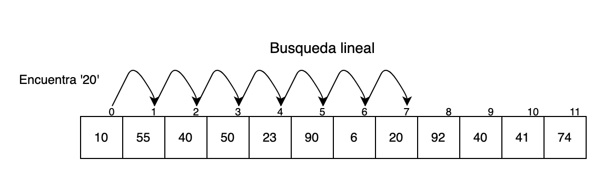

    - ### Busqueda binaria
        - Estos algoritmos estan disenados especificamente para buscar elementos en listas ordenadas. Estos son mucho mas eficientes que los lineales ya que comprueba el centro de la estructura repetidamente dividiendo el espacio a la mitad cada vez.
    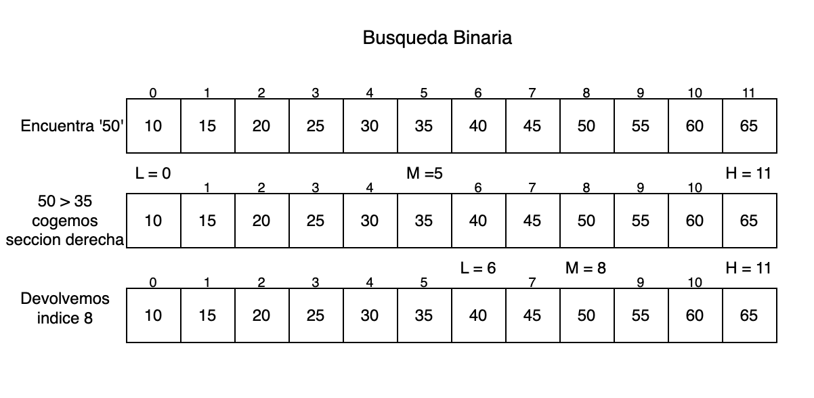

- [Programacion dinamica](./src/main/java/org/losenlaces/algorithms/dynamic/Dynamic.java)
    - La programación dinámica es principalmente una optimización sobre la recursividad simple. Dondequiera que veamos una solución recursiva que tiene llamadas repetidas para las mismas entradas, podemos optimizarla usando Programación Dinámica. La idea es simplemente almacenar los resultados de los subproblemas, para que no tengamos que volver a calcularlos cuando sea necesario más adelante. Esta sencilla optimización reduce las complejidades del tiempo de exponencial a polinomial.
    Por ejemplo, si escribimos una solución recursiva simple para los números de Fibonacci, obtenemos una complejidad de tiempo exponencial y si la optimizamos almacenando soluciones de subproblemas, la complejidad de tiempo se reduce a lineal.

    - ### Recursividad
    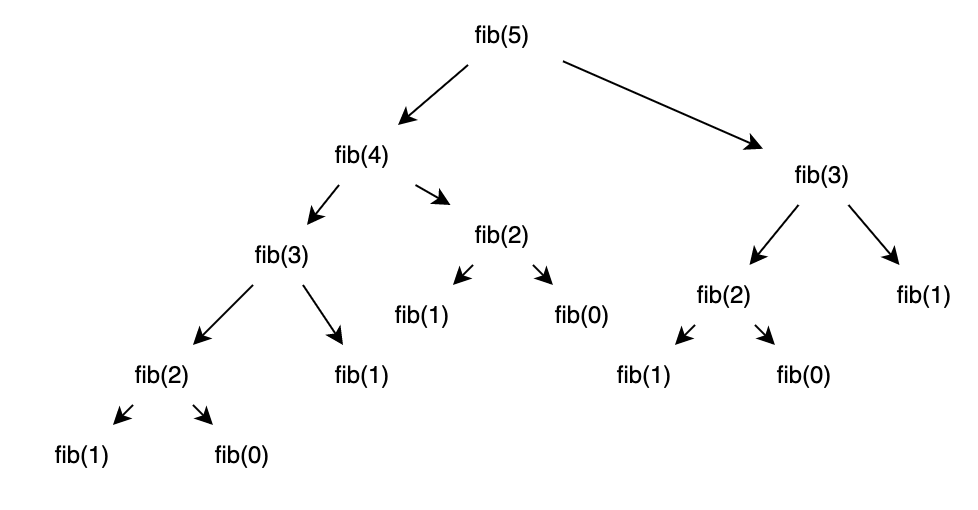

    - ### Recursividad + Memorizacion
    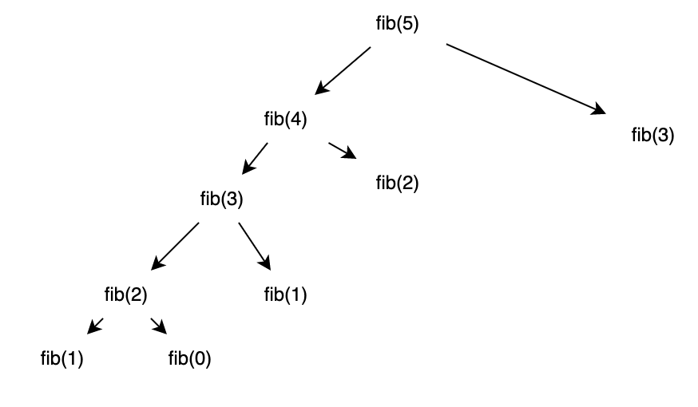

- [Union](./src/main/java/org/losenlaces/algorithms/union/DisjointSetExample.java)

    - Una estructura de datos que almacena un subconjunto de elementos no superpuestos o disjuntos se denomina estructura de datos de conjuntos disjuntos. 

    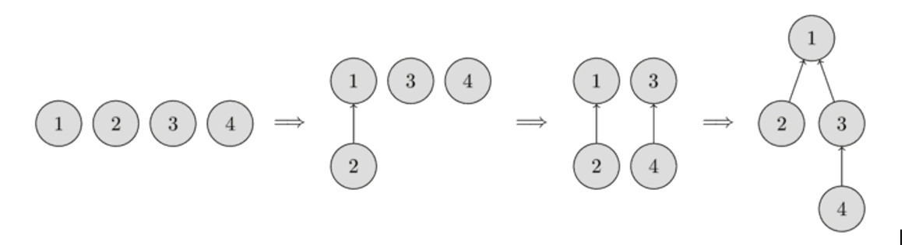
